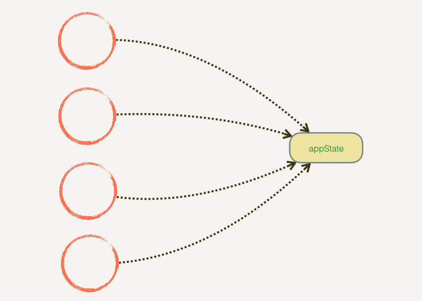
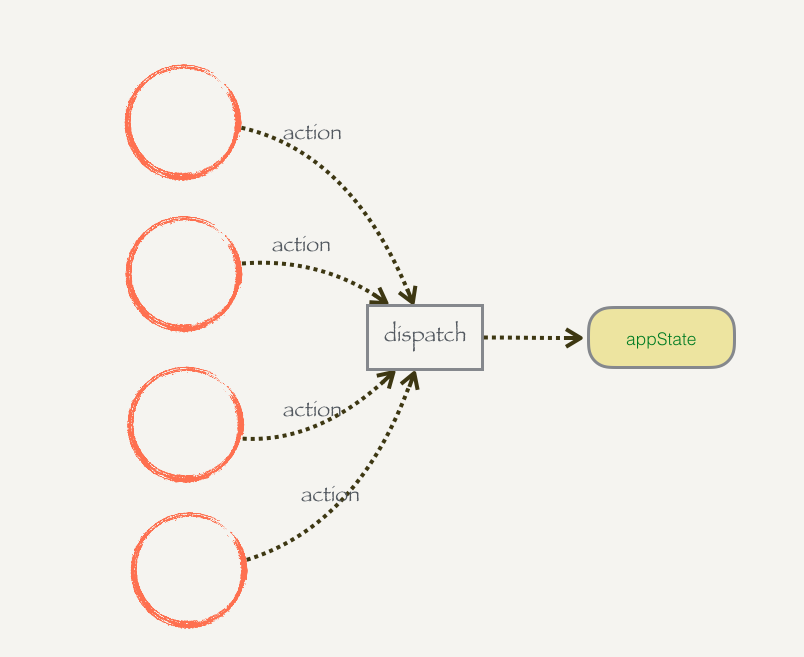

## 函数式编程在前端中的真正用途

### Is React functional programming?

#### 渲染模式

UI = View(State)

#### Components as functions

```jsx
const Hello = (props) => <div>Hello {props.name}!</div>;
```

#### Immutability of props

Immutability of props => no input argument must be changed by a function

#### Redux 优雅的修改共享状态

(state, action) => state

前端组件中的共享状态

A 状态会被 B,C 组件**影响**或者**依赖**

或者更多的，D E F G 函数用到这个状态，H I J K L 组件会影响这个状态





#### 尽管是动态类型语言


### 实际的场景

#### 优化绑定

说白了前端和后端不一样的关键点是后端HTTP较多，前端渲染多，前端真正的刚需是数据绑定机制。后端一次对话，计算好Response发回就完成任务了，所以后端吃了二十年年MVC老本还是挺好用的。前端处理的是连续的时间轴，并非一次对话，像后端那样赋值简单传递就容易断档，导致状态不一致，带来大量额外复杂度和Bug。不管是标准FRP还是Mobx这种命令式API的TFRP，内部都是基于函数式设计的。函数式重新发明的Return和分号是要比裸命令式好得多的（前端状态可以同步，后端线程安全等等，想怎么封装就怎么封装）

#### 封装作用

接上条，大幅简化异步，IO，渲染等作用/副作用相关代码。和很多人想象的不一样，函数式很擅长处理作用，只是多一层抽象，如果应用稍微复杂一点，这点成本很快就能找回来（Redux Saga是个例子，特别是你写测试的情况下）。渲染现在大家都可以理解幂等渲染地好处了，其实函数式编程各种作用和状态也是幂等的，对于复杂应用非常有帮助。

#### 复用

引用透明，无副作用，代数设计让函数式代码可以正确优雅地复用。前端不像后端业务固定，做好业务分析和DDD就可以搭个静态结构，高枕无忧了。前端的好代码一定是活的，每处都可能乱改。可组合性其实很重要。通过高阶函数来组合效果和效率都要高于继承，试着多用ramda，你就可以发现绝大部分东西都能一行写完，最后给个实参就变成一个UI，来需求改两笔就变成另外一个。

---

### 合理使用函数式（

#### Redux 的 Store 管理选择

- 某个状态只被 1 个组件依赖影响

那这个状态放在组件里的 `state` 是完全没问题的，没有其他组件可以访问到它

- 某个状态被多个组件依赖影响

🌰：Button => HTTP => Loading Model (Loading State)

那这个 `Loading State` 的状态是放在 `<Button />` 组件里还是放在 `<Loading />` 组件里呢？

其实都不合适，必然会导致另一个组件的依赖。解决方法是把这种状态**抽离出来作为公共部分**

这才是 Redux 这类状态管理解决的问题：管理多个组件所依赖或者影响的状态